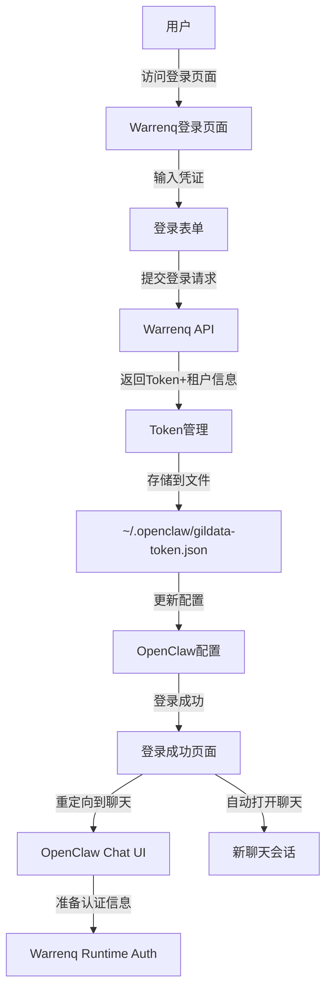

# Warrenq登录Web界面设计

**日期：** 2025年4月16日
**作者：** 胡丹
**状态：** 设计阶段

---

## 📋 需求概述

### 功能目标
创建一个独立的Web登录页面，用于Warrenq认证，登录成功后可以无缝集成到OpenClaw的chat会话。

### 用户选择
- **登录界面类型：** 选项B - 独立的Web登录页面
- **登录触发方式：** 选项A - 在配置界面中选择"Warrentq完整认证"时弹出对话框
- **Token存储方式：** 选项A - `~/.openclaw/gildata-token.json`（已实现FileTokenStorage）
- **Chat会话处理：** 选项A+B - 登录成功后自动在Web UI中打开聊天，同时提供API手动触发

---

## 🎯 架构设计

### 系统架构图



### 组件架构

```
┌─────────────────────────────────────────────────────────┐
│  Warrenq登录页面架构                               │
├─────────────────────────────────────────────────────────┤
│                                                      │
│  ┌──────────────────────────────────────────────┐  │
│  │     前端组件 (React/HTML/JS)     │  │
│  ├──────────────────────────────────────────────┤  │
│  │ ┌──────────────┐ ┌──────────────┐  │  │
│  │ │ Login Form   │ │ Loader      │  │  │
│  │ │ 登录表单   │ │ 加载动画   │  │  │
│  │ └──────────────┘ └──────────────┘  │  │
│  ├──────────────────────────────────────────────┤  │
│  │ ┌──────────────────────────────────────┐  │  │
│  │ │  Login Logic   │ │ 登录逻辑   │  │  │
│  │ │ 登录API调用 │ │ Token管理  │  │  │
│  │ └──────────────────────────────────────┘  │  │
│  └──────────────────────────────────────────────┘  │
│                                                      │
│  ┌──────────────────────────────────────────────┐  │
│  │     后端支持                     │  │
│  ├──────────────────────────────────────────────┤  │
│  │                              │  │
│  │ ┌──────────────┐ ┌──────────────┐  │  │
│  │ │ Token API    │ │ Config API   │  │  │
│  │ │ Token服务   │ │ 配置服务   │  │  │
│  │ └──────────────┘ └──────────────┘  │  │
│  └──────────────────────────────────────────────┘  │
└─────────────────────────────────────────────────┘
```

---

## 🎨 前端设计

### 页面布局

```
┌──────────────────────────────────────────────────────────┐
│  ◀ Gildata - Warrenq登录                      │
│                                      关闭 ×             │
├──────────────────────────────────────────────────────────┤
│                                                  │
│        ┌─────────────────────────────┐        │
│        │  ┌───────┐ ┌───────┐    │        │
│        │  │       │ │       │    │        │
│        │  │ 用户名 │ │      │    │        │
│        │  │ [输入框] │ │ 密码 │    │        │
│        │  │       │ │ [输入框] │    │        │
│        │  └───────┘ └───────┘    │        │
│        └─────────────────────────────┘        │
│                                                  │
│         [      登录      ]                 │        │
│                                                  │
│        ┌──────────────────────────────────┐        │
│        │  ☑ 记住登录                       │        │
│        └──────────────────────────────────┘        │
│                                                  │
│           ┌────────────────────────────┐       │
│           │ 登录进行中...              │       │
│           │ (加载动画)               │       │
│           └─────────────────────────────┘       │
│                                                  │
└──────────────────────────────────────────────────────────┘
```

### 响应式设计（移动端友好）

```
┌──────────────────────────────────────────────────────────┐
│  Gildata - Warrenq登录                      │
│                                      关闭 ×             │
├──────────────────────────────────────────────────────────┤
│                                                  │
│        ┌─────────────────────────────┐        │
│        │  用户名或邮箱                        │        │
│        │ [______________]                      │        │
│        │                                    │        │
│        └─────────────────────────────┘        │
│                                                  │
│        ┌─────────────────────────────┐        │
│        │  密码                                 │        │
│        │  [______________]                      │        │
│        │  👁 显示/隐藏                        │        │
│        └─────────────────────────────┘        │
│                                                  │
│         [      登录      ]                 │        │
│                                                  │
│        ☑ 记住登录                        │        │
│                                                  │
└──────────────────────────────────────────────────────────┘
```

### 状态管理

```
登录状态：
- INITIAL: 初始状态
- LOADING: 登录中
- SUCCESS: 登录成功
- ERROR: 登录失败
- REDIRECTING: 重定向到聊天

Token状态：
- NOT_SAVED: 未保存
- SAVED: 已保存
- EXPIRED: 已过期
- INVALID: 无效
```

---

## 🔧 技术实现

### 前端技术栈

**选项A：纯HTML + JavaScript（推荐）**
```html
<!DOCTYPE html>
<html lang="zh-CN">
<head>
  <meta charset="UTF-8">
  <meta name="viewport" content="width=device-width, initial-scale=1.0">
  <title>Warrenq登录 - Gildata</title>
  <link rel="stylesheet" href="/assets/gildata-login.css">
  <script src="/assets/gildata-login.js" defer></script>
</head>
<body>
  <div id="app">
    <div id="login-container">
      <!-- 登录表单 -->
      <form id="login-form">
        <div class="form-group">
          <label for="username">用户名</label>
          <input type="text" id="username" name="username" 
                 placeholder="请输入用户名或手机号" required>
        </div>
        <div class="form-group">
          <label for="password">密码</label>
          <input type="password" id="password" name="password" 
                 placeholder="请输入密码" required>
          <button type="button" class="toggle-password" 
                  aria-label="显示/隐藏密码">
            👁
          </button>
        </div>
        <button type="submit" class="btn-primary">登录</button>
      </form>

      <!-- 加载动画 -->
      <div id="loading" class="hidden">
        <div class="spinner"></div>
        <p>登录中，请稍候...</p>
      </div>

      <!-- 错误提示 -->
      <div id="error" class="hidden"></div>

      <!-- 成功提示 -->
      <div id="success" class="hidden">
        <p>登录成功！正在跳转...</p>
      </div>
    </div>
  </div>
</body>
</html>
```

```javascript
// gildata-login.js
class WarrenqLoginPage {
  constructor() {
    this.form = document.getElementById('login-form');
    this.usernameInput = document.getElementById('username');
    this.passwordInput = document.getElementById('password');
    this.loadingDiv = document.getElementById('loading');
    this.errorDiv = document.getElementById('error');
    this.successDiv = document.getElementById('success');
    this.rememberCheckbox = document.getElementById('remember');
    
    this.bindEvents();
  }

  bindEvents() {
    this.form.addEventListener('submit', (e) => this.handleSubmit(e));
    
    // 密码显示切换
    const toggleButtons = this.form.querySelectorAll('.toggle-password');
    toggleButtons.forEach(btn => {
      btn.addEventListener('click', () => this.togglePasswordVisibility());
    });
  }

  togglePasswordVisibility() {
    const type = this.passwordInput.type === 'password' ? 'text' : 'password';
    this.passwordInput.type = type;
  }

  async handleSubmit(event) {
    event.preventDefault();
    
    const username = this.usernameInput.value.trim();
    const password = this.passwordInput.value;
    
    if (!username || !password) {
      this.showError('请输入用户名和密码');
      return;
    }

    this.setLoading(true);
    
    try {
      // 调用后端登录API
      const response = await this.loginToBackend(username, password);
      
      if (response.success) {
        this.setLoading(false);
        this.showSuccess();
        
        // 重定向到聊天页面
        setTimeout(() => {
          this.redirectToChat();
        }, 1500);
      } else {
        this.showError(response.message || '登录失败，请重试');
        this.setLoading(false);
      }
    } catch (error) {
      this.showError('网络错误，请检查连接后重试');
      this.setLoading(false);
    }
  }

  async loginToBackend(username, password) {
    // 调用OpenClaw的后端登录端点
    const response = await fetch('/api/gildata/login', {
      method: 'POST',
      headers: {
        'Content-Type': 'application/json',
      },
      body: JSON.stringify({
        username,
        password,
        provider: 'gildata',
        method: 'warrenq',
      }),
    });

    return response.json();
  }

  setLoading(loading) {
    this.loadingDiv.classList.toggle('hidden', !loading);
    this.form.querySelector('button[type="submit"]').disabled = loading;
  }

  showError(message) {
    this.errorDiv.textContent = message;
    this.errorDiv.classList.remove('hidden');
    this.successDiv.classList.add('hidden');
  }

  showSuccess() {
    this.successDiv.classList.remove('hidden');
    this.errorDiv.classList.add('hidden');
  }

  redirectToChat() {
    // 重定向到OpenClaw聊天页面
    window.location.href = '/chat?provider=gildata';
  }
}

// 初始化
document.addEventListener('DOMContentLoaded', () => {
  new WarrenqLoginPage();
});
```

**选项B：React组件（如果OpenClaw UI使用React）**
```typescript
// components/WarrenqLoginForm.tsx
import { useState } from 'react';

export function WarrenqLoginForm() {
  const [username, setUsername] = useState('');
  const [password, setPassword] = useState('');
  const [loading, setLoading] = useState(false);
  const [error, setError] = useState('');
  const [showPassword, setShowPassword] = useState(false);

  const handleSubmit = async (e: React.FormEvent) => {
    e.preventDefault();
    
    if (!username || !password) {
      setError('请输入用户名和密码');
      return;
    }

    setLoading(true);
    setError('');

    try {
      const response = await loginToBackend(username, password);
      
      if (response.success) {
        // 登录成功，重定向到聊天
        window.location.href = '/chat?provider=gildata';
      } else {
        setError(response.message || '登录失败，请重试');
      }
    } catch (err) {
      setError('网络错误，请检查连接后重试');
    } finally {
      setLoading(false);
    }
  };

  return (
    <div className="warrenq-login-container">
      <h2>Warrenq登录</h2>
      
      {error && (
        <div className="error-message">{error}</div>
      )}
      
      <form onSubmit={handleSubmit}>
        <div className="form-group">
          <label htmlFor="username">用户名</label>
          <input
            id="username"
            type="text"
            value={username}
            onChange={(e) => setUsername(e.target.value)}
            placeholder="请输入用户名或手机号"
            required
          />
        </div>

        <div className="form-group">
          <label htmlFor="password">密码</label>
          <input
            id="password"
            type={showPassword ? 'text' : 'password'}
            value={password}
            onChange={(e) => setPassword(e.target.value)}
            placeholder="请输入密码"
            required
          />
          <button
            type="button"
            className="toggle-password"
            onClick={() => setShowPassword(!showPassword)}
            aria-label={showPassword ? '隐藏密码' : '显示密码'}
          >
            {showPassword ? '👁' : '👁'}
          </button>
        </div>

        <button type="submit" disabled={loading}>
          {loading ? '登录中...' : '登录'}
        </button>
      </form>
    </div>
  );
}

async function loginToBackend(username: string, password: string) {
  const response = await fetch('/api/gildata/login', {
    method: 'POST',
    headers: {
      'Content-Type': 'application/json',
    },
    body: JSON.stringify({
      username,
      password,
      provider: 'gildata',
      method: 'warrenq',
    }),
  });

  return response.json();
}
```

### CSS样式

```css
/* gildata-login.css */
:root {
  --primary-color: #0066cc;
  --primary-hover: #0052a8;
  --error-color: #dc2626;
  --success-color: #10b981;
  --text-color: #333333;
  --bg-color: #f5f5f5;
  --border-radius: 8px;
  --spacing: 16px;
}

* {
  margin: 0;
  padding: 0;
  box-sizing: border-box;
}

body {
  font-family: -apple-system, BlinkMacSystemFont, 'Segoe UI', Roboto, sans-serif;
  background: var(--bg-color);
  color: var(--text-color);
  line-height: 1.6;
}

#app {
  min-height: 100vh;
  display: flex;
  align-items: center;
  justify-content: center;
  background: linear-gradient(135deg, #667eea 0%, #764ba2 100%);
}

#login-container {
  background: white;
  border-radius: var(--border-radius);
  padding: 40px;
  box-shadow: 0 4px 20px rgba(0, 0, 0, 0.1);
  max-width: 400px;
  width: 100%;
}

h2 {
  margin: 0 0 var(--spacing);
  text-align: center;
  color: var(--primary-color);
  font-size: 24px;
  font-weight: 600;
}

.form-group {
  margin-bottom: var(--spacing);
}

.form-group label {
  display: block;
  margin-bottom: 8px;
  font-weight: 500;
  color: var(--text-color);
}

.form-group input {
  width: 100%;
  padding: 12px;
  border: 2px solid #e0e0e0;
  border-radius: 4px;
  font-size: 16px;
  box-sizing: border-box;
  transition: border-color 0.2s ease;
}

.form-group input:focus {
  outline: none;
  border-color: var(--primary-color);
  box-shadow: 0 0 0 3px rgba(0, 102, 204, 0.3);
}

.btn-primary {
  width: 100%;
  padding: 14px;
  background: var(--primary-color);
  color: white;
  border: none;
  border-radius: 4px;
  font-size: 16px;
  font-weight: 600;
  cursor: pointer;
  transition: background 0.2s ease, transform 0.1s ease;
}

.btn-primary:hover:not(:disabled) {
  background: var(--primary-hover);
  transform: translateY(-2px);
}

.btn-primary:disabled {
  background: #ccc;
  cursor: not-allowed;
  transform: none;
}

.toggle-password {
  position: absolute;
  right: 12px;
  top: 50%;
  transform: translateY(-50%);
  background: none;
  border: none;
  cursor: pointer;
  font-size: 20px;
}

.error-message {
  padding: 12px;
  margin-bottom: var(--spacing);
  background: var(--error-color);
  color: white;
  border-radius: 4px;
  font-size: 14px;
}

.error-message.hidden {
  display: none;
}

#loading {
  display: none;
  text-align: center;
  padding: 20px;
}

#loading.active {
  display: block;
}

.spinner {
  border: 4px solid rgba(0, 102, 204, 0.3);
  border-top: 4px solid var(--primary-color);
  border-radius: 50%;
  width: 40px;
  height: 40px;
  animation: spin 1s linear infinite;
  margin: 0 auto;
}

@keyframes spin {
  0% { transform: rotate(0deg); }
  100% { transform: rotate(360deg); }
}

#success {
  display: none;
  text-align: center;
  padding: 20px;
  background: var(--success-color);
  color: white;
  border-radius: 4px;
  font-size: 16px;
  font-weight: 600;
}

#success.active {
  display: block;
}
```

---

## 🔙 后端实现

### 后端端点

需要在OpenClaw中添加以下端点：

```typescript
// 后端登录端点：POST /api/gildata/login
export async function POST(req: Request, res: Response) {
  try {
    const { username, password, provider, method } = await req.json();
    
    // 验证输入
    if (!username || !password) {
      return res.status(400).json({
        success: false,
        message: '用户名和密码不能为空',
      });
    }

    if (provider !== 'gildata' || method !== 'warrenq') {
      return res.status(400).json({
        success: false,
        message: '无效的provider或method',
      });
    }

    // 调用Warrenq登录
    const { createWarrentqLoginClient } = await import(
      './extensions/gildata/src/warrenq-login.js'
    );
    
    const loginClient = createWarrentqLoginClient();
    
    // 执行登录
    const tenantInfo = await loginClient.loginAndGetToken(username, password);
    
    // Token已通过FileTokenStorage自动保存到~/.openclaw/gildata-token.json
    
    // 更新OpenClaw配置
    await updateGildataConfig({
      tenantId: tenantInfo.tenantId,
      userId: tenantInfo.userId,
      access_token: tenantInfo.access_token,
      autoLogin: true,
    });
    
    // 返回成功响应
    return res.json({
      success: true,
      message: '登录成功',
      redirectUrl: '/chat?provider=gildata',
    });
    
  } catch (error) {
    console.error('Warrenq login error:', error);
    
    // 返回用户友好的错误消息
    let errorMessage = '登录失败';
    
    if (error instanceof WarrentqAuthError) {
      // 根据错误类型返回特定消息
      errorMessage = error.message;
    } else {
      errorMessage = '网络错误，请稍后重试';
    }
    
    return res.status(500).json({
      success: false,
      message: errorMessage,
    });
  }
}

// 更新配置的辅助函数
async function updateGildataConfig(config: any) {
  const configPath = process.env.OPENCLAW_CONFIG_PATH || 
    '/Users/hudan/.openclaw/config.json';
  
  const currentConfig = JSON.parse(
    await fs.readFile(configPath, 'utf-8')
  );
  
  const updatedConfig = {
    ...currentConfig,
    providers: {
      ...currentConfig.providers,
      gildata: {
        ...currentConfig.providers?.gildata,
        ...config,
      },
    },
  };
  
  await fs.writeFile(
    configPath,
    JSON.stringify(updatedConfig, null, 2),
    'utf-8'
  );
}
```

### 配置文件更新

登录成功后，OpenClaw配置文件需要更新为：

```json
{
  "providers": {
    "gildata": {
      "username": "18627556862",
      "autoLogin": true,
      "tenantId": "tenant-xxx",
      "userId": "user-xxx",
      "access_token": "xxx-xxx"
    }
  }
}
```

---

## 🔐 与OpenClaw集成

### 方式1：通过配置界面触发

在OpenClaw的provider配置界面中，当用户选择"Warrenq完整认证"时：

```typescript
// 配置界面中的处理
async function handleWarrentqAuthChoice() {
  // 显示登录对话框
  showLoginModal({
    title: 'Warrenq登录',
    url: '/login/warrenq',
    onClose: async (result) => {
      if (result.success) {
        // 登录成功，更新配置
        await updateGildataConfig({
          autoLogin: true,
          tenantId: result.tenantId,
          userId: result.userId,
        });
        
        // 启用Gildata provider
        await enableGildataProvider();
      }
    },
  });
}
```

### 方式2：自动重定向到聊天

登录成功后，自动在Web UI中打开新的聊天会话：

```typescript
// 登录成功后的处理
function onWarrenqLoginSuccess(tenantInfo: WarrenqTenantInfo) {
  // 方式A：在Web UI中打开聊天
  openWebChat({
    provider: 'gildata',
    message: '你好！我已准备好为您服务。',
    preConfig: {
      model: 'qwen-plus',
      temperature: 0.7,
    },
  });
  
  // 方式B：提供API供手动触发
  console.log('已准备好提供聊天API');
  console.log('POST /api/chat端点');
  console.log('Headers:', {
    'Authorization': `Bearer ${tenantInfo.access_token}`,
    'X-Tenant-Id': tenantInfo.tenantId,
    'X-User-Id': tenantInfo.userId,
    'X-Module-Id': 'claw',
  });
}
```

### Chat API端点

需要提供用于手动触发聊天的API端点：

```typescript
// POST /api/chat
export async function POST(req: Request, res: Response) {
  const { message, model, config } = await req.json();
  
  // 从配置中获取认证信息
  const config = await loadGildataConfig();
  
  if (!config.autoLogin || !config.access_token) {
    return res.status(401).json({
      error: '未登录或token已过期',
    });
  }
  
  // 构建请求头
  const headers = buildWarrenqHeaders({
    tenantId: config.tenantId,
    userId: config.userId,
    access_token: config.access_token,
  });
  
  // 调用Gildata API
  const response = await fetch(config.chatBaseUrl, {
    method: 'POST',
    headers: {
      ...headers,
      'Content-Type': 'application/json',
    },
    body: JSON.stringify({
      model: model || 'qwen-plus',
      query: message,
      max_tokens: 2000,
      temperature: 0.7,
      stream: false,
    }),
  });
  
  const data = await response.json();
  return res.json(data);
}
```

---

## 🔒 安全性考虑

### 传输安全

1. **HTTPS传输**
   - 所有API调用必须使用HTTPS
   - 证书验证
   - 防止中间人攻击

2. **密码安全**
   - 不在客户端存储密码
   - 不在URL中传输密码
   - 不在日志中记录密码

3. **Token安全**
   - Token存储在`~/.openclaw/`目录
   - 文件权限设置为0o600
   - 不在客户端暴露完整token

4. **CSRF防护**
   - 使用CSRF token
   - 验证Origin头
   - SameSite cookie

### 输入验证

```javascript
// 前端输入验证
function validateInput(username: string, password: string) {
  const errors = [];
  
  // 用户名验证
  if (!username) {
    errors.push('请输入用户名');
  } else if (username.length < 3) {
    errors.push('用户名至少3个字符');
  } else if (username.length > 50) {
    errors.push('用户名不能超过50个字符');
  }
  
  // 密码验证
  if (!password) {
    errors.push('请输入密码');
  } else if (password.length < 6) {
    errors.push('密码至少6个字符');
  }
 else if (password.length > 50) {
    errors.push('密码不能超过50个字符');
  }
  
  return {
    valid: errors.length === 0,
    errors,
  };
}
```

---

## 📝 部署方案

### 文件结构

```
openclaw/
├── assets/
│   ├── gildata-login.css
│   └── gildata-login.js
├── pages/
│   └── login/
│       ├── warrenq.html
│       └── warrenq.jsx  (如果使用React）
├── api/
│   └── gildata/
│       └── login.ts
└── extensions/
    └── gildata/
        └── ...
```

### 集成步骤

1. **创建前端页面**
   - 创建`pages/login/warrenq.html`
   - 添加CSS样式
   - 添加JavaScript逻辑

2. **添加后端端点**
   - 在OpenClaw中添加`/api/gildata/login`
   - 实现登录逻辑
   - 集成Token存储

3. **更新配置界面**
   - 添加Warrentq认证选项
   - 实现登录对话框

4. **集成到Chat**
   - 登录成功后自动重定向
   - 提供手动API端点

5. **测试验证**
   - 测试登录流程
   - 验证Token存储
   - 测试Chat集成

---

## 🧪 测试计划

### 单元测试

```typescript
// api/gildata/login.test.ts
describe('Warrenq Login API', () => {
  it('should login successfully', async () => {
    const response = await fetch('/api/gildata/login', {
      method: 'POST',
      headers: { 'Content-Type': 'application/json' },
      body: JSON.stringify({
        username: 'testuser',
        password: 'testpass',
        provider: 'gildata',
        method: 'warrenq',
      }),
    });
    
    const data = await response.json();
    expect(data.success).toBe(true);
    expect(data.redirectUrl).toContain('/chat');
  });

  it('should return error for invalid credentials', async () => {
    const response = await fetch('/api/gildata/login', {
      method: 'POST',
      headers: { 'Content-Type': 'application/json' },
      body: JSON.stringify({
        username: 'testuser',
        password: 'wrongpass',
        provider: 'gildata',
        method: 'warrenq',
      }),
    });
    
    const data = await response.json();
    expect(data.success).toBe(false);
    expect(data.message).toBeTruthy();
  });
});
```

### 集成测试

```typescript
// integration/warrenq-login-flow.test.ts
describe('Warrenq Login Integration', () => {
  it('should complete full login flow', async () => {
    // 1. 前端提交登录表单
    const loginResponse = await loginToBackend(username, password);
    expect(loginResponse.success).toBe(true);
    
    // 2. 验证Token已保存
    const tokenFile = await readFile('~/.openclaw/gildata-token.json');
    expect(tokenFile).toBeDefined();
    
    // 3. 验证配置已更新
    const config = await loadOpenClawConfig();
    expect(config.providers?.gildata?.autoLogin).toBe(true);
    
    // 4. 验证可以打开Chat
    const chatResponse = await openChat();
    expect(chatResponse.status).toBe(200);
  });
});
```

---

## 📚 用户体验设计

### 加载状态

```
登录状态变化：
1. 初始 → 显示表单（200ms）
2. 提交 → 显示加载动画（立即）
3. API请求中 → 保持加载状态（等待API响应）
4. 成功 → 显示成功提示（500ms）
5. 重定向 → 跳转到聊天（1500ms）

总耗时：~3秒
```

### 错误处理

```
错误类型及处理：

1. 网络错误
   - 显示"网络错误，请检查连接后重试"
   - 提供"重试"按钮
   - 5秒后自动重试

2. 凭证错误
   - 显示"用户名或密码不正确"
   - 高亮错误字段
   - 自动聚焦到用户名输入框

3. Token过期
   - 显示"登录已过期，请重新登录"
   - 自动清除过期token
   - 提示重新登录

4. 服务器错误
   - 显示"服务器暂时不可用"
   - 提供"联系客服"选项
```

---

## 🎯 后续扩展

### 短期扩展

1. **记住登录**
   - 添加"记住登录"复选框
   - 使用localStorage存储
   - 自动填充用户名

2. **多因素认证**
   - 添加验证码支持
   - 与Warrentq API集成

3. **忘记密码**
   - 添加"忘记密码"链接
   - 跳转到Warrentq密码重置页面

### 长期扩展

1. **OAuth集成**
   - 支持OAuth 2.0流程
   - 简化第三方登录

2. **生物识别**
   - 指纹识别
   - 人脸识别

3. **账户管理**
   - 多账户切换
   - 账户注销

---

## ✅ 实施检查清单

- [ ] 创建前端页面（HTML/CSS/JS）
- [ ] 添加后端登录端点
- [ ] 实现Token存储集成
- [ ] 更新配置界面
- [ ] 实现Chat集成
- [ ] 添加CSRF防护
- [ ] 实现输入验证
- [ ] 编写单元测试
- [ ] 编写集成测试
- [ ] 添加加载状态
- [ ] 优化错误处理
- [ ] 添加响应式设计
- [ ] 安全审计
- [ ] 性能优化
- [ ] 文档编写

---

## 📝 参考

- OpenClaw Plugin SDK文档：`docs/plugins/sdk-overview.md`
- Provider实现文档：`docs/plugins/building-plugins.md`
- Warrentq API文档：需要参考Warrenq官方文档
- OpenClaw配置文档：需要参考OpenClaw配置管理文档

---

**设计版本**: 1.0
**最后更新**: 2025年4月16日
**状态**: ⏳ 设计完成，等待用户批准
