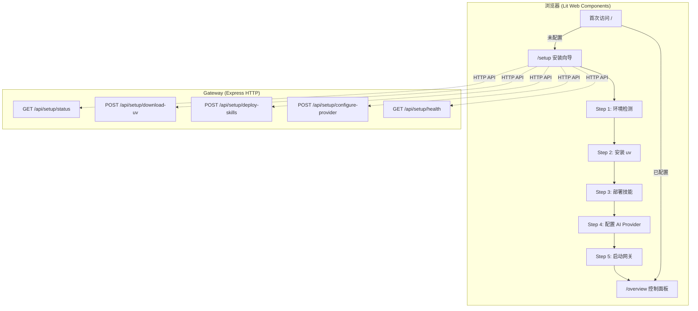

# OpenClaw Web 安装向导 — 实施方案

> 作者：胡丹
> 日期：2026-04-18
> 状态：规划中

## 1. 整体架构



## 2. 分阶段实施计划

### Phase 1: Gateway 安装 API（后端）

**新增文件**: `src/gateway/server/setup-http.ts`

```typescript
// 安装状态持久化到 ~/.openclaw/setup-state.json
interface SetupState {
  uvInstalled: boolean;
  skillsDeployed: boolean;
  providerConfigured: boolean;
  gatewayStarted: boolean;
}
```

| 端点 | 方法 | 功能 | 实现要点 |
|------|------|------|----------|
| `/api/setup/status` | GET | 返回当前安装状态 | 读取 `~/.openclaw/setup-state.json`，检测 uv 二进制、skills 目录、provider 配置 |
| `/api/setup/download-uv` | POST | 触发 uv 下载 | 调用 `scripts/download-uv.mjs` 逻辑（提取为可导入函数），SSE 推送进度 |
| `/api/setup/deploy-skills` | POST | 触发技能部署 | 调用 `scripts/prepare-preinstalled-skills.mjs` 逻辑，SSE 推送进度 |
| `/api/setup/configure-provider` | POST | 保存 AI Provider 配置 | 写入 `~/.openclaw/config.yaml`，验证 API Key 有效性 |
| `/api/setup/health` | GET | 检测网关健康状态 | 复用现有 health check 逻辑 |

**关键设计**：
- 安装操作耗时较长（网络下载），使用 SSE (Server-Sent Events) 推送实时进度
- 每个步骤幂等，支持中断后重试
- 状态持久化到 `~/.openclaw/setup-state.json`

### Phase 2: 安装向导 UI（前端）

**新增文件结构**:
```
ui/src/ui/views/
├── setup/
│   ├── setup-wizard.ts          # 向导主组件
│   ├── setup-step-check.ts      # Step 1: 环境检测
│   ├── setup-step-uv.ts         # Step 2: 安装 uv
│   ├── setup-step-skills.ts     # Step 3: 部署技能
│   ├── setup-step-provider.ts   # Step 4: 配置 AI Provider
│   ├── setup-step-complete.ts   # Step 5: 完成
│   └── setup-styles.css         # 样式
```

**向导步骤设计**：

```
Step 1: 环境检测（自动）
├── 检测操作系统、Node.js 版本
├── 检测网关是否已运行
├── 检测现有配置
└── 自动跳过已完成的步骤

Step 2: 安装 uv（一键/自动）
├── 显示下载进度
├── 版本信息展示
└── 安装失败重试按钮

Step 3: 部署技能（一键/自动）
├── 显示技能列表和下载进度
├── 每个技能独立状态（成功/失败/跳过）
└── 支持部分成功继续

Step 4: 配置 AI Provider（表单）
├── 选择 Provider（OpenAI/Anthropic/Azure/自定义）
├── 输入 API Key（密码框 + 验证）
├── 可选：选择默认模型
└── 连接测试按钮

Step 5: 完成
├── 总结安装结果
├── 一键启动网关（或跳转到控制面板）
└── 跳转 /overview
```

**修改文件**: `ui/src/ui/navigation.ts`

```typescript
// 新增 Tab 类型
export type Tab = ... | "setup";

// 新增路径映射
setup: "/setup",
```

**修改文件**: `ui/src/ui/app-render.ts`

- 新增 `setup` tab 的渲染分支
- 首次运行检测：当 gateway 连接失败且无本地配置时，自动导航到 `/setup`

### Phase 3: 首次运行检测

**修改文件**: `ui/src/ui/app-gateway.ts`

```typescript
// 连接失败时的逻辑增强
async connectGateway() {
  try {
    await this.gatewayClient.connect();
  } catch {
    // 检查是否首次运行（无本地配置）
    const setupState = await fetch('/api/setup/status').catch(() => null);
    if (!setupState?.ok || !setupState.completed) {
      // 自动跳转到安装向导
      this.setTab('setup');
      return;
    }
    // 已配置但网关未启动，显示启动提示
    this.showGateawayNotRunning();
  }
}
```

### Phase 4: 离线模式支持

安装向导 UI 的 HTML 需要能在**网关未启动时**访问。两个策略（二选一）：

| 策略 | 优点 | 缺点 |
|------|------|------|
| **A: 静态 HTML** | 无需网关运行即可访问 | 需要单独的构建入口和轻量 HTTP 服务器 |
| **B: 内嵌到 Gateway** | 复用现有基础设施 | 需要先启动网关（可用默认配置启动） |

**推荐方案 A**：在 `scripts/ui.js` 中增加 `setup` 命令，启动一个极简 HTTP 服务器（用 Node 内置 `http` 模块）仅提供安装向导页面，安装完成后引导用户启动网关。

## 3. 技术选型

| 组件 | 选择 | 理由 |
|------|------|------|
| UI 框架 | Lit（现有） | 与 openclaw UI 一致 |
| 进度推送 | SSE | 比 WebSocket 轻量，单向推送足够 |
| 配置存储 | `~/.openclaw/setup-state.json` | 与现有 openclaw 配置目录一致 |
| 样式 | 复用现有 CSS 变量 | 保持 UI 一致性 |

## 4. 工作量估算

| Phase | 预估 | 关键风险 |
|-------|------|----------|
| Phase 1: Gateway API | 2-3 天 | SSE 进度推送的可靠性 |
| Phase 2: 向导 UI | 3-4 天 | Lit 组件状态管理 |
| Phase 3: 首次检测 | 0.5 天 | 低风险 |
| Phase 4: 离线模式 | 1 天 | 静态资源打包策略 |
| **总计** | **7-9 天** | |

## 5. 与 ClawX 的对比

| 维度 | ClawX | openclaw 方案 |
|------|-------|---------------|
| 运行环境 | Electron 桌面应用 | 浏览器 + Gateway |
| 安装触发 | 应用启动 | 首次访问 UI |
| uv 下载位置 | `resources/bin/` (应用内) | `~/.openclaw/bin/` (用户目录) |
| 技能部署位置 | `build/preinstalled-skills/` (应用内) | `~/.openclaw/skills/` (用户目录) |
| 配置存储 | electron-store (JSON) | `~/.openclaw/` 目录 |
| 进度展示 | Electron IPC | SSE → Lit 组件 |

## 6. 前置已完成工作

以下脚本已实现并验证通过（作为 `pnpm ui:dev` 的自动准备步骤）：

| 文件 | 说明 |
|------|------|
| `scripts/download-uv.mjs` | 下载 uv 二进制到 `~/.openclaw/bin/{platform}/` |
| `scripts/prepare-preinstalled-skills.mjs` | 从 GitHub 拉取预装技能到 `~/.openclaw/skills/` |
| `resources/skills/preinstalled-manifest.json` | 预装技能清单（pdf/xlsx/docx/pptx 等 8 个） |
| `scripts/ui.js` (已修改) | `dev` 命令前自动执行准备步骤 |

## 7. 建议实施顺序

从 **Phase 1（Gateway API）** 开始，因为前端依赖后端接口。Phase 2-4 可根据 Phase 1 的 API 设计并行推进。
